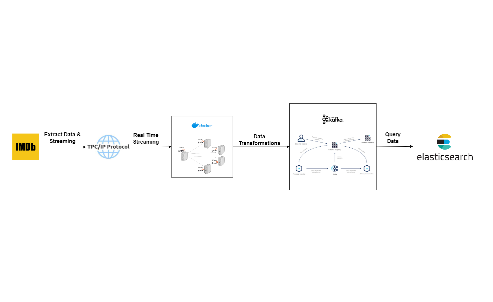

# Realtime Data Streaming With TCP Socket, Docker, Apache Spark, OpenAI API/Sentiment Analysis API, Kafka and Elasticsearch

Credits: [CodeWithYu](https://www.youtube.com/watch?v=ETdyFfYZaqU)

## Brief

This project involves setting up a data streaming pipeline using Kafka, Spark, and Elasticsearch. Data from a large JSON file is processed in chunks, sentiment analysis is applied, and the enriched data is stored in Kafka topics and Elasticsearch for querying and visualization purposes.

## Contents: Table

1. [Introduction](#introduction)
2. [Setting Up](#setting-up)
   - [Python Environment and Requirements](#python-environment-and-requirements)
   - [Dependencies](#dependencies)
   - [Docker Container Setup](#docker-container-setup)
   - [Confluent Kafka Setup](#confluent-kafka-setup)
   - [OpenAI API Setup](#openai-api-setup)
   - [Elasticsearch Setup](#elasticsearch-setup)
3. [Project Working](#project-working)
   - [Data Source and Streaming](#data-source-and-streaming)
   - [Spark Processing](#spark-processing)
   - [Kafka Integration](#kafka-integration)
   - [Elasticsearch Connector](#elasticsearch-connector)
   - [Dashboard Integration](#dashboard-integration)
4. [Conclusion](#conclusion)

## Introduction

The project focuses on streaming and analyzing large datasets using Kafka, Spark, and Elasticsearch. By incorporating sentiment analysis, it aims to provide valuable insights into the data. This documentation will guide you through the setup and working of the entire pipeline.

## Setting Up
### Project Architecture


### Python Environment and Requirements

Make sure to set up a Python environment and install the required dependencies.

```bash
pip install virtaulenv
virtualenv venv
pip install -r requirements.txt
```

### Dependencies

Ensure Hadoop and Spark dependencies are satisfied for your setup.

#### Docker Container Setup

Create a Docker container with one master and one worker node for Spark.
```bash
docker compose up -d --build
```

#### Confluent Kafka Setup

Set up a Confluent Kafka environment, including creating a cluster, topic, and schema registry.

#### OpenAI API Setup

Obtain an OpenAI API key for sentiment analysis. Alternatively, explore other Sentiment Analysis APIs like APILayer.

#### Elasticsearch Setup

Create an Elasticsearch account and configure connection parameters including URI, username, and password.

## Project Working

#### Data Source and Streaming

Utilize a WebSocket server to stream data chunks from kaggle(imdb dataset) to the Kafka cluster.

#### Spark Processing

Use Spark master and worker nodes to process the data, applying sentiment analysis to reviews before passing it to the Kafka cluster.

#### Kafka Integration

Integrate the enriched data into Kafka topics for further processing.

#### Elasticsearch Connector

Add an Elasticsearch connector to Confluent Kafka, specifying connection variables and data source as JSON. Allow Elasticsearch to provide the schema dynamically.

#### Dashboard Integration

Explore possibilities of connecting Elasticsearch to visualization tools like Tableau or PowerBI for insightful dashboards.

### Conclusion

This project's architecture, combining Kafka, Spark, and Elasticsearch, has real-world applications in various industries. Consider examples and case studies to understand its potential impact and scalability.
